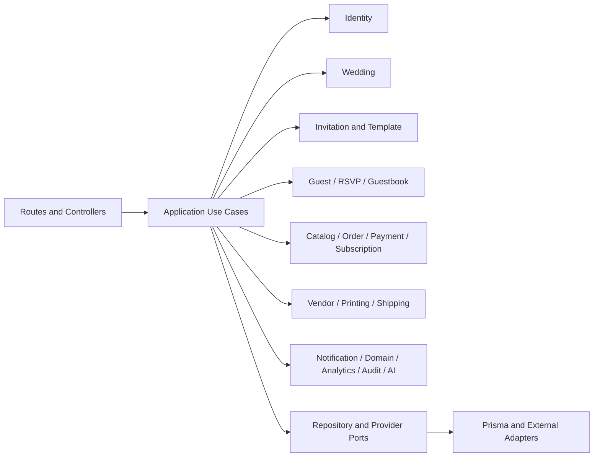

# Component Diagram

```mermaid
flowchart LR
  Routes[Routes and Controllers] --> UseCases[Application Use Cases]
  UseCases --> Identity[Identity]
  UseCases --> Wedding[Wedding]
  UseCases --> Invitation[Invitation and Template]
  UseCases --> Guest[Guest / RSVP / Guestbook]
  UseCases --> Commerce[Catalog / Order / Payment / Subscription]
  UseCases --> Fulfillment[Vendor / Printing / Shipping]
  UseCases --> Platform[Notification / Domain / Analytics / Audit / AI]
  UseCases --> Ports[Repository and Provider Ports]
  Ports --> Adapters[Prisma and External Adapters]
```
