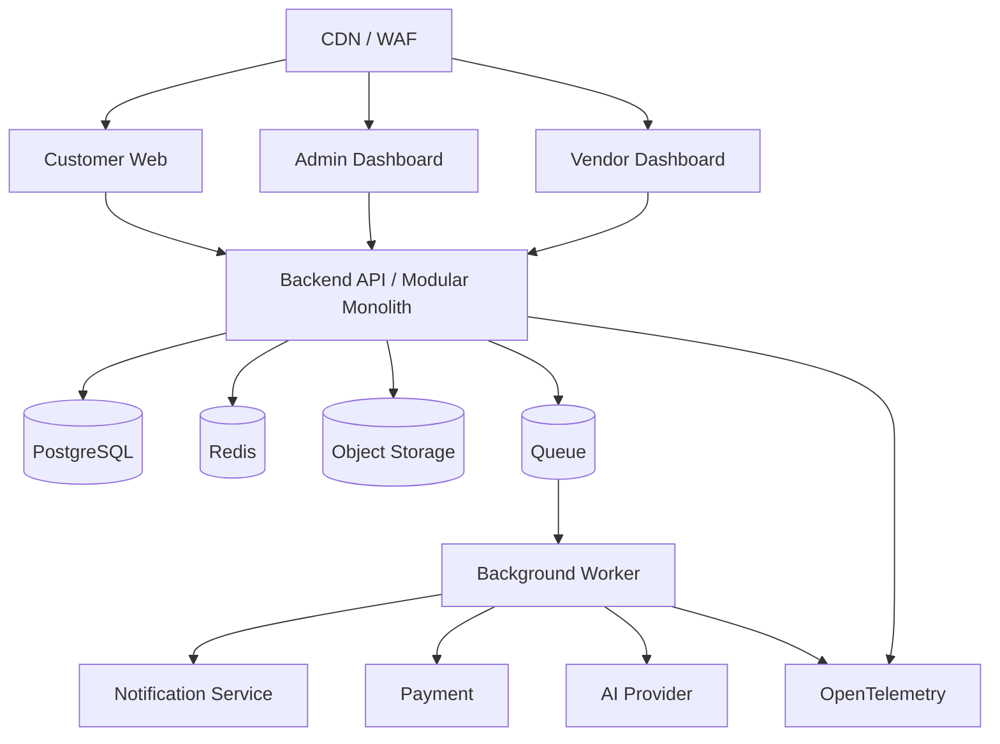

# Container Diagram

```mermaid
flowchart TB
  Edge[CDN / WAF] --> Customer[Customer Web]
  Edge --> Admin[Admin Dashboard]
  Edge --> Vendor[Vendor Dashboard]
  Customer --> API[Backend API / Modular Monolith]
  Admin --> API
  Vendor --> API
  API --> DB[(PostgreSQL)]
  API --> Redis[(Redis)]
  API --> Store[(Object Storage)]
  API --> Queue[(Queue)]
  Queue --> Worker[Background Worker]
  Worker --> Notify[Notification Service]
  Worker --> Pay[Payment]
  Worker --> AI[AI Provider]
  API --> OTel[OpenTelemetry]
  Worker --> OTel
```
