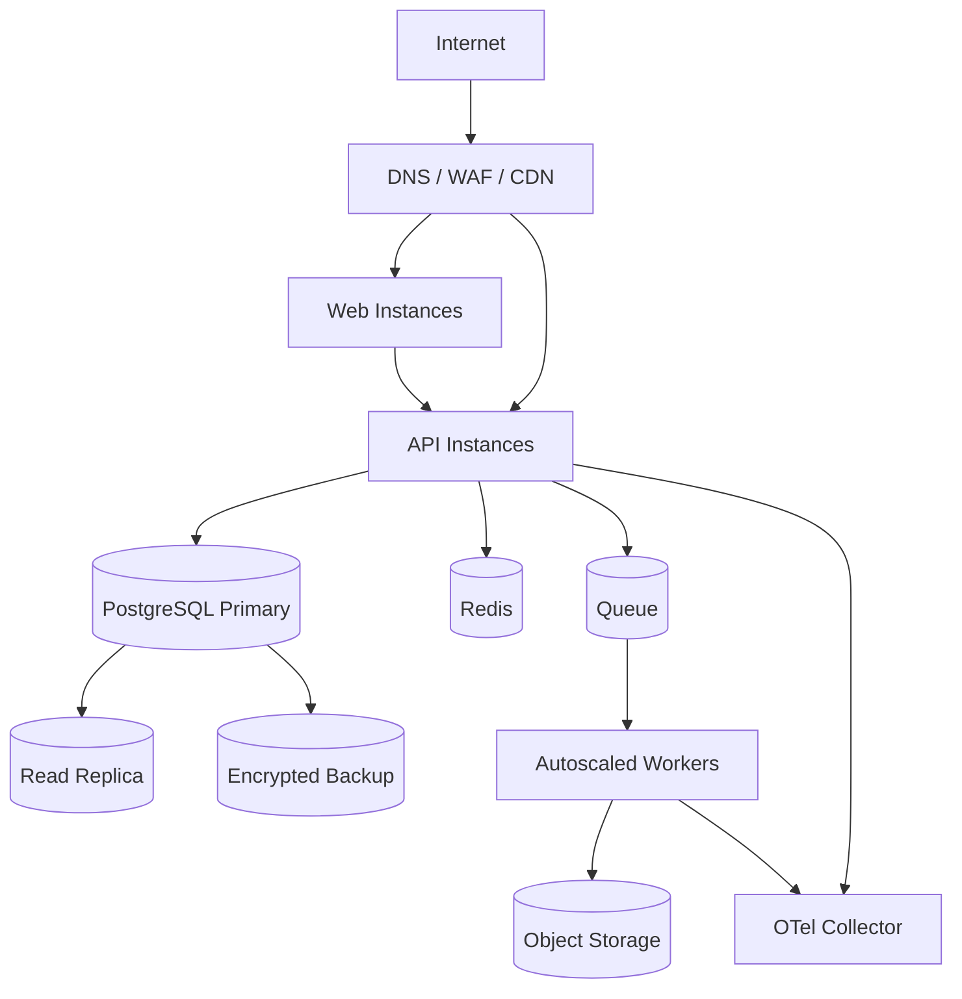

# Deployment Diagram

```mermaid
flowchart TB
  Internet --> DNS[DNS / WAF / CDN]
  DNS --> WebA[Web Instances]
  DNS --> APIA[API Instances]
  WebA --> APIA
  APIA --> DB[(PostgreSQL Primary)]
  DB --> Replica[(Read Replica)]
  APIA --> Redis[(Redis)]
  APIA --> Queue[(Queue)]
  Queue --> Workers[Autoscaled Workers]
  Workers --> Store[(Object Storage)]
  DB --> Backup[(Encrypted Backup)]
  APIA --> OTel[OTel Collector]
  Workers --> OTel
```
